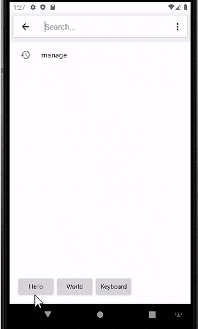
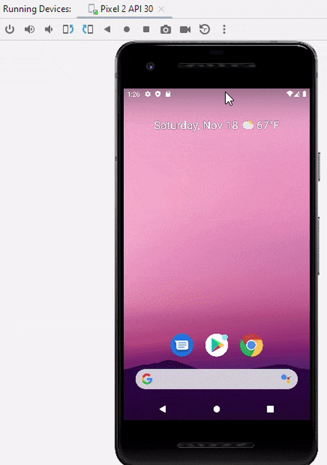

# Hello World Keyboard

Welcome to the Hello World Keyboard project! 
This custom Android keyboard is a perfect starting point for first-time Android developers interested in exploring custom keyboard development. 
The keyboard features three simple buttons that input "hello", "world", and "keyboard".

## Getting Started

These instructions will guide you through forking the project, making it your own, and setting up a development environment for testing and further development.

### Prerequisites

Before you start, ensure you have Android Studio installed, the official IDE for Android app development:

- [Install Android Studio](https://developer.android.com/studio/install)

### Forking and Cloning the Project

1. **Fork the Repository**:
    - Visit the original repository at `https://github.com/modularizer/helloworldkeyboard`.
    - Click on the `Fork` button at the top right corner of the page to create a copy of the repository in your GitHub account.

2. **Clone Your Fork**:
    - After forking, go to your GitHub account where the new repository exists.
    - Open the forked repository and click on `Code` to get the clone URL.
    - Copy the URL.

3. **Import the Project in Android Studio**:
    - Open Android Studio.
    - Go to `File` > `New` > `Project from Version Control`.
    - In the URL field, paste the URL of your forked repository.
    - Choose your preferred directory and click `Clone`.

### Running and Testing the Project

1. **Set Up an Emulator**:
    - Go to Tools > Device Manager > Create Device to create a new Virtual Device.
    - Choose a device definition and a system image.

2. **Run the App**:
    - With the emulator open, run the app from Android Studio.

3. **Enable and Test the Keyboard**:
    - In the emulator, navigate to `Settings` (hint: double-tap the top bar, swipe down, find the gear icon)
    - In Settings, search `Manage on-screen Keyboards` or navigate to `Settings` > `System` > `Languages & input` > `On-screen keyboard` > `Manage on-screen keyboards`.
    - Enable `Hello World Keyboard`.
    - Open any text field, and in the bottom right corner of the screen, tap the keyboard icon to switch to your new keyboard.

## Customizing Your Keyboard
### Key Files for Customization
- `app/src/main/java/com.example.helloworldkeyboard/KeyboardService.kt`: Main service for keyboard logic.
- `app/src/main/res/keyboard_layout.xml`: Layout file for the keyboard UI.
- `app/src/main/res/values/strings.xml`: Strings file for keyboard UI text.
- `app/src/main/AndroidManifest.xml`: App declarations and configurations.

### Tips for Designing Your Keyboard
- **Layout**: Modify `keyboard_layout.xml` for UI changes.
- **Functionality**: Adapt `KeyboardService.kt` for different key actions.
- **Testing**: Always test changes on an emulator or device.

## Contributing

This project is open to contributions with the goal of making an absolute bare-bones keyboard for first-time Android developers,
encouraging best practices and good coding habits while also providing a starting point for further development.
Feel free to fork this repository, make your changes, and submit pull requests to contribute to this project.

## License

This project is 100% open source and free to use for any purpose.
This project is licensed under the [Unlicense](https://unlicense.org) - see the [LICENSE](LICENSE) file for details.

